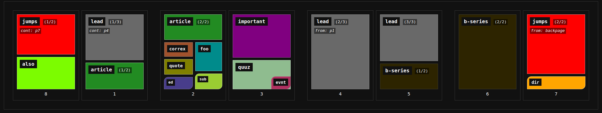
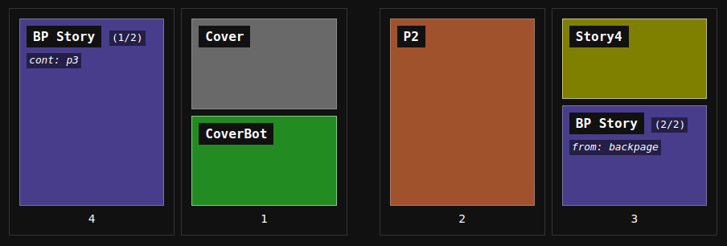
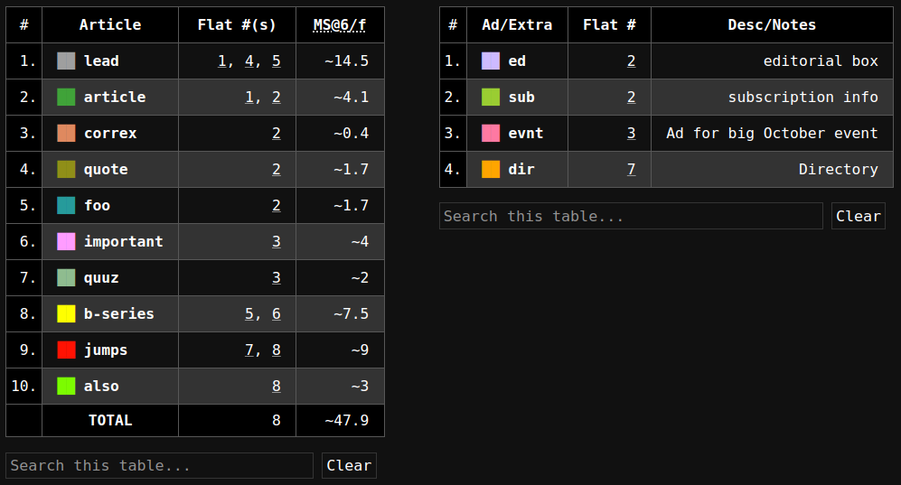
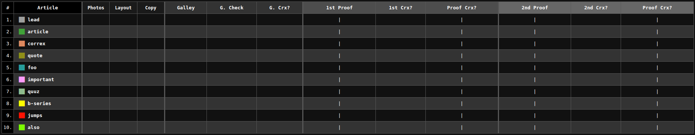

# pubmap

Create simple HTML dummy pages from a CSV for print production planning.



## Install

Clone repo, and run `make install` in the project directory.

```
$ git clone https://github.com/jakejohns/pubmap.git
$ cd pubmap
$ make install
```

see `Makefile` for info.

**note**: make sure that `$XDG_DATA_HOME/bin` (default: `~/.local/bin/`) is in
`PATH`. (edit `~/.bashrc`, `~/.zshrc`, etc. and add `EXPORT PATH="$PATH:$HOME/.local/bin/"`)

## Usage

Use `pubmap` to read `pubmap.csv` and output `pubmap.html`

```sh
$ pubmap < pubmap.csv > pubmap.html
```

### Options

Set options on the command line using the following flags. eg. to set the name
of the project you can use:

```sh
pubmap --name "My Publication No. 1337" < pubmap.csv > pubmap.html
```

| option   | description                                           |
| -------- | ----------------------------------------------------- |
| `--name` | set name of publication                               |
| `--mpf`  | set number of manuscript pages per flat for estimates |

### `pubmap.csv`

- Each line is a flat. (eg. Line 1 = Page 1.)
- Elements are separated by comma.

```csv
Cover, CoverBot
P2
Story4, BP Story
BP Story
```



By default, elements have a "weight" of `1`, and divide the flat equally.

#### Metacharacters

Metacharacters alter element behavior.

|    CHAR    | Effect                                                                               |
| :--------: | :----------------------------------------------------------------------------------- |
|    `:2`    | **Set Weight**: where `2` is _any number_, overwrite default "weight" `1`.           |
| `[` or `]` | **Open/Close Split**: inner elements share a row (nested Split reverts to stacking). |
| `<` or `>` | **Inset Corner**: place element at bottom left/right.                                |
|    `^`     | **Inset Top**: place element at top instead.                                         |
|    `*`     | **Extra**: don't consder elment in manuscript page calculations or tracking.         |
|    `#`     | **Note**: add description to extra element.                                          |

#### Example

Preview: [docs/screenshot/example.png](docs/screenshot/example.png)

```csv
lead:2, article
article:5, [[ correx, quote:4, *ed #editorial box ], [ foo:4, * sub # subscription info ]]
important:2, quuz, > *evnt # Ad for big October event
lead
lead:3, b-series
b-series
jumps, *dir:0 # Directory
jumps, also
```

##### Elements and Estimates

Story length estimated by configurable "manuscript per flat" (`MPF`). Default: 6.

```
pubmap --mpf 3 < pubmap.csv
```



##### BirdsEye View

Generate a global tracking sheet for elements not marked as "extra."



## Configuration

If a `pubmap.cfg` file is present in the current directory, variables are loaded
from it. You can setup a "pubmap project" by adding a `pubmap.cfg` file in, for
example, the top level of your publication project directory (eg.
`/mnt/server/pubs/my-pub-1337/pubmap.cfg`). This file can define the basic attributes
of you project, and you can use the `pubmap update` command to update a map
based on the setting is in this file.

For example, to update a map in an directory configured as a "pubmap project":

```
$ cd /server/pubs/my-pub-1337
$ pubmap update
```

### `pubmap.cfg`

The following `pubmap.cfg` defines the name of the publication, the file to
write the map to, and the "manuscript pages per flat" count used for page
estimates.

```cfg
NAME          = "My Publication No. 1337"
PUBMAP_OUTPUT = pubmap.html
MFP           = 3
```

## Other Topics

### Stow vs Install

If stow is available, you can choose to clone the project somewhere permanent
and "stow" it instead of "install" it. This will use stow to symlink files in
the appropriate locations rather than copy. This is useful if your hacking on
the project, or you want to just be able to fetch and "restow" to update.

```
$ make stow
```
