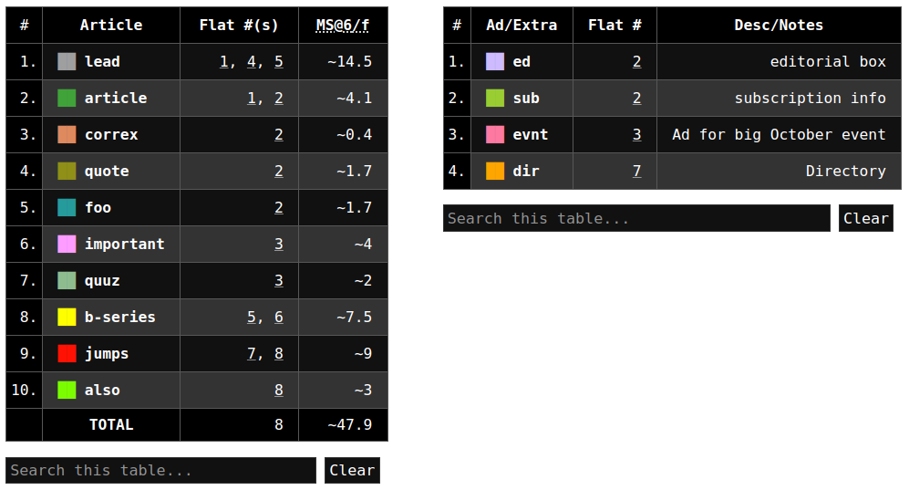
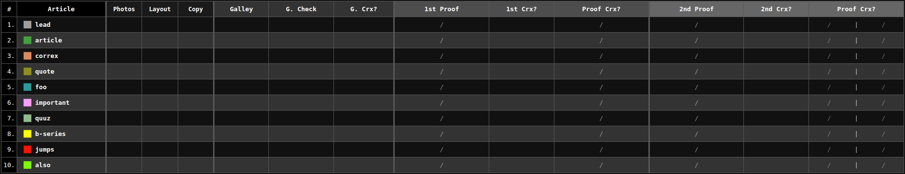

# pubmap

Create simple HTML dummy pages from a CSV for print production planning.


## Install

Clone repo, then....

```
$ make install
```

Alternatively, if stow is available....

```
$ make stow
```

see `Makefile` for info.

**note**: make sure that `$XDG_DATA_HOME/bin` (default: `~/.local/bin/`) is in `PATH`. (edit `~/bashrc`, `~/.zshrc`, etc.)

## Usage

Use `pubmap` to read `pubmap.csv` and output `pubmap.html`

```sh
$ pubmap < pubmap.csv > pubmap.html
```

### `pubmap.csv`

- Each line is a flat. (eg. Line 1 = Page 1.)
- Elements are separated by comma.

```csv
Cover, CoverBot
P2
Story4, BP Story
BP Story
```


By default, elements have a "weight" of `1`, and divide the flat equally.

#### Metacharacters

Metacharacters alter element behavior.

|    CHAR    | Effect                                                                               |
| :--------: | :----------------------------------------------------------------------------------- |
|    `:2`    | **Set Weight**: where `2` is _any number_, overwrite default "weight" `1`.           |
| `[` or `]` | **Open/Close Split**: inner elements share a row (nested Split reverts to stacking). |
| `<` or `>` | **Inset Corner**: place element at bottom left/right.                                |
|    `^`     | **Inset Top**: place element at top instead.                                         |
|    `*`     | **Extra**: don't consder elment in manuscript page calculations or tracking.         |
|    `#`     | **Note**: add description to extra element.                                          |

#### Example

Preview: [docs/screenshot/example.png](docs/screenshot/example.png)

```csv
lead:2, article
article:5, [[ correx, quote:4, *ed #editorial box ], [ foo:4, * sub # subscription info ]]
important:2, quuz, > *evnt # Ad for big October event
lead
lead:3, b-series
b-series
jumps, *dir:0 # Directory
jumps, also
```

##### Elements and Estimates

Story length estimated by configurable "manuscript per flat" (`MPF`). Default: 6.

```
pubmap --mpf 3 < pubmap.csv
```



##### BirdsEye View

Generate a global tracking sheet for elements not marked as "extra."


